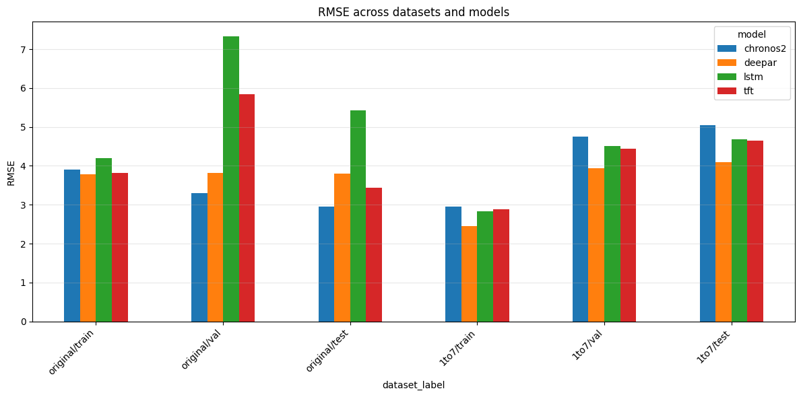
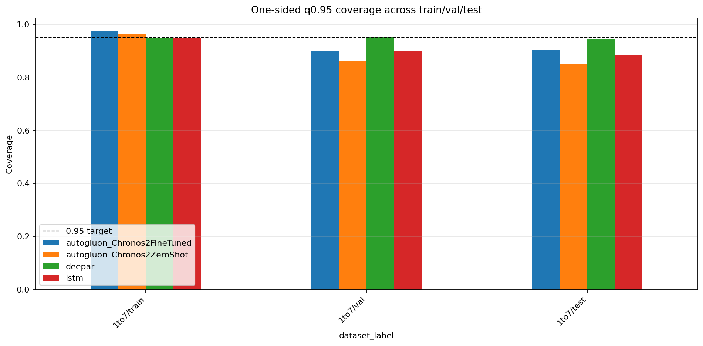
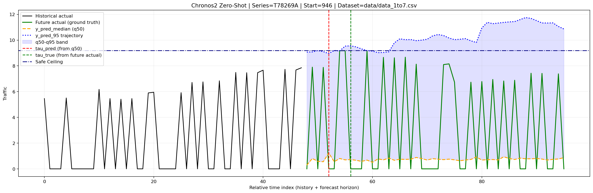
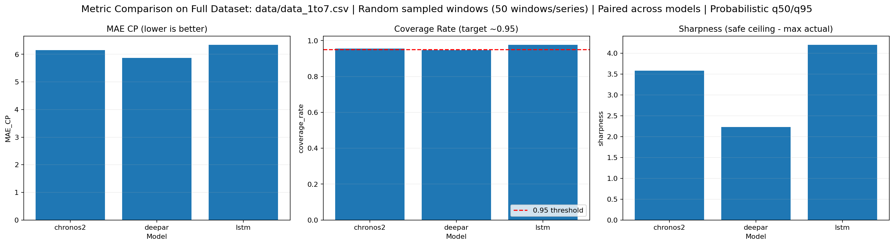
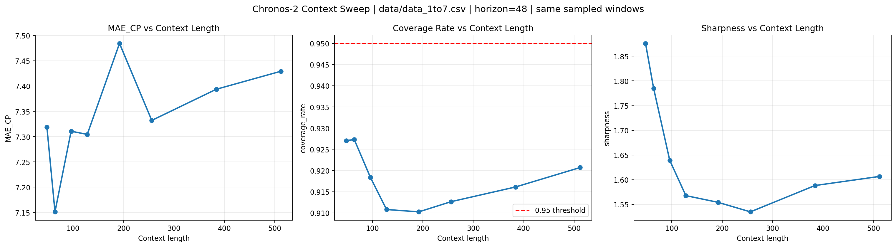

# LLM6G
Forecasting per-sector traffic to support energy-aware radio access networks using deep learning.

## Environment
- Create an isolated environment (e.g., `python3 -m venv .venv && source .venv/bin/activate`).
- Install dependencies from `requirements.txt` (`pip install -r requirements.txt`). Chronos inference runs on device; GPU is optional.
- AutoGluon fine-tuning requires `autogluon.timeseries>=1.0` alongside the base PyTorch stack.

## Goal and approach
- We forecast traffic (Mbps) for each antenna sector to inform sleep-mode and energy-management policies.
- The pipeline relies on zero-shot Chronos family models (Chronos-T5, Chronos-Bolt, Chronos-2) without fine-tuning; we only prepare data and evaluate.

## Overall view on the Chronos models
- The Chronos models are foundational models for time series. ([1]). They are pre-trained on an extremely large time-series dataset (here put the approximate size). Its architecture is the same as an LLM: transformer-based for long-term attention, parallelized training, and scalable parameter count, using a decoder-only structure (Chronos-T5 is encoder–decoder; Chronos-Bolt/Chronos-2 are decoder-only). Tokenization is the main difference compared to text generation tasks. Here the input space is a continuous 1-D time series.
The continuous input space is discretized into tokens, called bins.
- For each input, we take a context of size `C` and predict a horizon of size `H`. Real-valued series are mean-scaled and quantized into a fixed vocabulary (4096 bins with PAD/EOS). The context vector is used to perform starndard-deviation-normalization (mean = 0) of the input. Scaling uses `m = 0` and `s = (1/C) * sum_{t=1..C} |x_t|`, so `x_t` becomes `x_t / s`. 
- Then the input is discretized. Quantization maps each scaled value to a bin ID: `q(x) = j` when `b_{j-1} <= x < b_j`, and dequantization uses the bin center `d(j) = c_j`. Uniform bins are placed between `c_1` and `c_B` (Chronos uses `c_1 = -15`, `c_B = +15`). 
- At this point we have the same setting as an LLM input, namely a sequence of tokens. We pad the input sequence if it is shorter than the context size, and we truncate by taking only the last values if it is longer.
- We then compute the distributions of the output sequence autoregressively. This means we use the C context tokens to get the forecast distribution of Xc+1; then we append the sampled token for `z_{C+1}` to the input sequence and use it to predict `z_{C+1}`, and so on, until the full prediction horizon is generated. `L = - sum_{h=1..H+1} log p_theta(z_{C+h} | z_{1:C+h-1})`.
- Forecasting is regression-via-classification. The predictions are distributions: during training, Chronos statistically learns the “general” distribution of time-series data (of every kind! e.g. finance, environmental, energy...) by minimizing cross-entropy between Chronos’s predicted token distribution and the “real-world” distribution represented in the large pretraining dataset.
- Now, regarding selection of the next token: we do not take the token with highest probability (argmax), unless we want deterministic decoding. Instead, Chronos uses the predicted probability distribution over bins to compute quantiles. From these quantiles, the model produces the median forecast and prediction intervals. Concretely, quantiles are obtained by inverting the discrete CDF derived from the token probabilities, giving a median and confidence intervals for each autoregressive step.
- During inference we autoregressively sample from `p_theta(z_{C+h} | z_{1:C+h-1})`, dequantize, and unscale. Point forecasts in this repo use either the 0.5-quantile returned by Bolt/Chronos-2 or the mean of `num_samples` draws for sample-based models.

## Data
- For our project, we want to predict the consumption of Mbps in antenna sectors to enable intelligent energy usage. The traffic on different antennas varies during the day, week, and months. There is not always the same number of people using them depending on the time. To make the system's energy consumption intelligent, we try to predict the Mbps consumption over time for the antennas.
- We have a dataset (`data/histo_trafic.csv`) of scalar values (Mbps) for 86 antennas, taken every week between June 2018 and January 2024, with between 257–286 scalar values for each antenna.
- `scripts/dataprocessing.py` normalizes timestamps (French dates → ISO), groups by sector, and writes one context/target pair per sector to JSONL for downstream evaluation. After preprocessing (`data/processed_trafic_original.jsonl`) contexts range from 257–286 points (mean ≈ 284).
- The first step is to expand this dataset using data augmentation techniques to create an instantaneous dataset. The idea, in a nutshell, is to compute statistical features from the dataset and use them to estimate the number of users during each period, which is then used to augment the data:
- Synthetic instantaneous dataset (`data/histo_trafic_instant.csv`): per-sector high-frequency series generated to emulate bursty arrivals following the digital-twin traffic model of Masoudi et al. ([2]). For each 5-minute slot (original dataset) we compute empirical mean/variance across days, assume an interrupted Poisson process (IPP) with ON/OFF rates `tau` and `zeta`, and solve for the Poisson rate `lambda` and mean per-arrival demand `E[psi]` such that:
  ```
  E[U] = lambda * tau/(tau + zeta) * T
  Var(U) ≈ lambda * tau/(tau + zeta) * T * (1 + 2*lambda*zeta/(tau + zeta)^2)
  E[Psi] = E[U] * E[psi]
  Var(Psi) = E[U] * Var(psi) + Var(U) * (E[psi])^2
  ```
  where `U` is the number of arrivals in window `T` and `Psi` the aggregated rate. 
- This yields per-second traffic sequences (≈49k–58k points per sector). A 5-sector subset lives in `data/histo_trafic_instant_short.csv` for quicker experiments. We then obtain a much larger dataset of size: 86 (antennas) times ~55k (augmented scalar values).
- Now, we compute the prediction of the last value in each antenna’s dataset using all previous values as context. The context (~55k tokens) is much larger than what the models can process: the maximum context sizes of the Chronos models range from 512 tokens (Chronos) to 8192 tokens (Chronos 2). Therefore, the models crop the input and only keep the most recent values (excluding the very last one) as context for predicting the final value.
- We perform the forecasting separately for each of the 86 antennas. The predictions are inherently stochastic, we repeat the experiment num_samples = 32 times and take the mean the 32 draws as the final prediction for sample based models.
- For each model in the Chronos family, we then compute the RMSE between this averaged prediction and the ground truth. Finally, we compute the average RMSE over all entries of our dataset, meaning over all antennas.

## Evaluation pipeline
- `scripts/single_eval.py` loads a Chronos pipeline, feeds each sector’s full history as context, and forecasts the final step (prediction length 1). The Chronos library internally truncates to each model’s maximum context window.
- For sample-based models we draw `num_samples=32` forecasts and average; for quantile-returning models we take the median. We report RMSE across sectors.

## Results
- Historical weekly data (`results/summary_hist_trafic_original.csv`, 86 sectors): best RMSE from `amazon/chronos-bolt-mini` (6.72).
- Synthetic instantaneous subset (`results/summary_hist_trafic_instant.csv`, 86 sectors): best RMSE from `amazon/chronos-bolt-tiny` (2.11).
- Interestingly the predicion accuracy doesn't always improve with the parameter count being higher. A reason for that might be the amount of predictions being low, the RMSE is only averaged over 86 values.
- The RMSE of the augmented dataset being three times lower than the one of the original dataset mainly is because of the amount of 0 scalar target values being higher, and those values being easier for the models to predict (lower RMSE for these targets). 
- Check `/results/evals/` for predictions and targets.

## Inference Comparison with LSTM Baseline (08/01 Meeting)

- We now want to compare inference capabilities of 0-shot prediction models with an LSTM trained on the dataset itself.
- Cleaning: First thing is to create a dataset for training/validation/testing. The data yields from the histogram of traffic_mbps of the 86 antenna sectors. One challenge is that some of the values of traffic are missing for some antennas. We should reformat the histogram to a table-like format for which one feature is the timestamp and the rest 86 features are the 86 antenna sectors. 
- To create this cleaned data we select the largest, continuous in time, dataset included in the histogram, for which none of the sectors has any missing values. The script 'utils/build_dataset.py' is used for this. The total number of points in the cleaned dataset with ZERO NaN values is now 49.6k compared to an average (over the sectors) of 55k points beforehand. For the original data it is now 129 points compared to the around 300 points beforehand. 
- Dataset: We split the data chronologically to avoid time-series data-leakage. We split the data into 3 datasets: Training (80%), Validation (10%), Testing (10%)
- We define models architecture in 'scripts/models.py'
- We define the Pytorch dataloaders in 'scripts/loader.py' and the Dataset Class in 'scripts/dataset.py'
- We define the Trainer Class in 'scripts/trainer.py'
- We define 'scripts/train_run.py' for the training run of the models
- For training run: train_run.py --model all
- At the same time, to check the logs run: tensorboard --logdir results/logs
- Instant Dataset is too computationally heavy for every model. We couldn't compute the metrics.
- Original dataset results are in 'notebook.ipynb': lstm is the best!  
- Patience parameter with validation dataset (set at 3)

## Quantile Loss Optimization LSTM/Chronos2 Comparison (15/01 Meeting):
- We now want to forecast quantiles instead of doing conditional mean regression - predicting the mean of Y/X (MSE Loss).
- Cross-Entropy loss optimization on bins (discretized space) allows for a more expressive pdf representation compared the conditional mean estimator we get from the L2 Loss optimization on the continuous space - which only work for a dataset of unimodal conditional pdf (Y/X).
- Quantile loss function is the Pinball Loss Function. It's averaged over the quantiles and the forecast horizon. The estimator of this objective function are the corresponding quantiles.
- RMSE is still one of the comparison metrics - with the median quantile as the forecasted point for both models. We could also use MAE as a comparison metric - we compute the median with the 0.5 quantile, not the mean. But as long as both model us the same forecasting method - namely the median point of the output pdf - RMSE is still a fair comparison metric.
- Results: Chronos2 is the undisputed winner in this training setting - and so amoung all relevant metrics (see 'notebook.ipynb')
- Note : Cross-Entropy Loss doesn't take into account the relative distance between bins. Bins discretization is a tradeoff between precision of forecasting (huge amount of bins) and feasable objective loss function that allows training (small amount of bin).
- 2nd Note: For several steps forecasting, auto-regressive models can be subjected to compounding errors. For time-series forecasting it might be better to avoid this and outpout the forecasted vector in a single forward pass.


## DeepAR and TFT Implementation and RMSE Benchmark (22/01 Meeting):

- On the original dataset chronos2 is the best model because of limited amount of training samples
- On the 1 to 7 instantaneous dataset; DeeepAR performs the best after training
- DeepAR is a probabilistic model, designed to be trained on several time-series. The time-series are assigned a score of being selected. An LSTM encodes the context history. A linear layer takes the encoded context and outputs the mean and std of a gaussian (for real-value prediction). The input history context is used for scaling sample-wise. The prediction linear layer output then gets re-sclaed. In our case we only train on one time-series. During inference it autoregressively predicts the next values from the input context. During training, the real value from the target forecast is used for the following predictions.
- DeepAR is trained using GaussianNLLLoss thus performing better for RMSE Metric on 1 to 7 dataset
- LSTM (quantile) and TFT are trained using quantile loss thus both perform better for quantile metrics on 1 to 7 dataset
- DeepAR Quantiles are computed with its output - namely its Gaussian parameters for each forecasted timestamp


## Coverage Benchmarking with Chronos-2 Finetuning (05/02 Meeting):




## Full System Design and Evaluation (03/03 Meeting)

### What is new in the repository:
- All of our forecasting stack is probabilistic end-to-end: each model returns `q50` (median path) and `q95` (upper path).
- LSTM is trained with Pinball loss for quantile regression; default training quantiles are now `(0.5, 0.95)` and the output is multi-step. One forward pass covers the full forecasting window quantiles preds.
- DeepAR remains Gaussian (`mu`, `sigma`) and is converted to quantiles during inference (`q50 = mu`, `q95 = mu + 1.645*sigma`).
- Chronos-2 integration now reads quantiles directly from model output tensors (no `num_samples` argument in `predict`); `q50`/`q95` indices are resolved from wrapper metadata, with fallback to Chronos-2 21-quantile layout (`10`, `-2`).
- Hybrid pipeline logic: detect first change point `tau_pred` on `q50` with Ruptures PELT, then compute the stationary “Safe Ceiling” as `max(q95[:tau_pred])` (or full horizon if no change point).
- Evaluation pipeline supports rolling and random window sampling on selected datasets (including full `data/data_1to7.csv` and `data/data_original.csv`) and saves metrics to `results/evaluation/`.
- Reported metrics are change-point MAE, tolerance hit rate, coverage rate under the predicted safe ceiling, and sharpness (over-provisioning).
- Visualization notebooks now plot history, future truth, `q50`, `q95`, `tau_pred`, `tau_true`, and save figures under `results/evaluation/` or `results/plots/`.

### Current System (Quick View):
- What we forecast:
  per-sector traffic time series (Mbps), using probabilistic trajectories `q50` (median) and `q95` (upper quantile) over a multi-step horizon.
- Pipeline:
  forecast (`q50`, `q95`) -> detect first change point `tau_pred` on `q50` -> compute safe ceiling as `max(q95[0:tau_pred])` -> evaluate against future ground truth and `tau_true`.
- Forecasting mode by model:
  `LSTM` outputs direct multi-step quantile vectors in one forward pass; `Chronos2` returns direct multi-step quantiles from its output tensor.
- DeepAR training vs inference:
  training uses teacher forcing on the full horizon (`context + true targets`, shifted input) and optimizes Gaussian NLL on all future steps; inference is autoregressive rollout, where each step reuses the previous prediction as next input.
- DeepAR quantile conversion in this repo:
  from Gaussian outputs, we use `q50 = mu` and `q95 = mu + 1.645*sigma` (deterministic path in eval with `sample=False`).
- Key hyperparameters used in system evaluation:
  `context_length`, `forecast_length/horizon`, quantiles (`0.5`, `0.95`), CP detector settings (`model='normal'`, `penalty`, `min_size`, `jump`), and sampling settings (rolling/random windows).
- Evaluation metrics:
  `MAE_CP` (change-point timing error), `Tolerance Hit Rate` (`|tau_pred - tau_true| <= 3`), `Coverage Rate` (`actual <= safe_ceiling`), `Sharpness` (`safe_ceiling - max(actual)`; lower is tighter), better to be positive.
- Coverage definition used in `system_eval`:
  for each sampled window, we detect `tau_true` on the future ground truth and build the true pre-change interval `[t, tau_true)` (or full horizon if no change). We then count the fraction of points in that interval that are below the predicted `safe_ceiling = max(q95[0:tau_pred])`. The reported `coverage_rate` is the global ratio `total_hits / total_points` aggregated over all sampled windows (length-weighted, not a simple mean of per-window coverages).

### Horizon Consistency (Train vs Eval):
- If eval horizon > training horizon:
  In `src/pipeline.py`, baseline checkpoints are extended autoregressively by chaining forecast blocks and feeding predicted `q50` back as new context. This increases compounding error, can flatten forecasts, and usually degrades CP detection and coverage.
- If eval horizon < training horizon:
  The model outputs are truncated to the first eval steps. This is valid, but those early-step metrics are not directly comparable to a model trained specifically for that shorter horizon.
- Practical recommendation:
  Keep `forecast_length` (training) == `horizon` (system eval) for LSTM/DeepAR/TFT benchmark runs. If you must mismatch, report it explicitly in results.

### Plot Configuration Note:
- For the benchmark plots shown here, we used:
  `context_length = 48` and `forecast_length = horizon = 48`.
- Reason:
  dataset split limitations (`val` and `test` lengths are too short for `128` in our setup), so `48` keeps enough valid evaluation windows.
- Sampling used for eval metrics:
  we evaluate on `50` random samples/windows per series (with paired windows across systems) and aggregate metrics over all sampled windows; with 86 series this is `50 x 86 = 4300` sampled windows per system.
- Important evaluation scope note:
  for these plots, system eval was run on the full `data/data_1to7.csv` timeline, including the first 80% that was used as training period for LSTM/DeepAR.
- Interpretation impact:
  this can make LSTM/DeepAR look stronger than on strictly unseen-only evaluation; we accepted this setup due to size limitations of standalone `val`/`test` portions for the chosen horizon/context settings.
- Consistency choice:
  we kept the same setting for system eval and Chronos2 comparison to keep results comparable across `LSTM`, `DeepAR`, and `Chronos2`.
- Expected tradeoff:
  we suspect Chronos2 could improve with a larger context window, but we do not increase it in these benchmark plots because the DL baselines (`LSTM`, `DeepAR`) are trained/evaluated with the shared constrained setup.





### Chronos-2 Context-Length Variation (48 -> 512):
- We benchmarked **Chronos-2** on `data/data_1to7.csv` with fixed `horizon=48` and varying context lengths:
  `48, 64, 96, 128, 192, 256, 384, 512`.
- To make contexts directly comparable, all runs use the **same sampled windows** (paired random windows, fixed seed, fixed evaluation start index).
- The coverage subplot includes a red `0.95` threshold line to visualize which context is closest to target coverage.




## References
- [1] A. F. Ansari et al., “Chronos-2: From Univariate to Universal Forecasting,” arXiv:2510.15821, 2025. (`sources/Chronos-2.pdf`)
- [2] M. Masoudi et al., “Digital Twin Assisted Risk-Aware Sleep Mode Management Using Deep Q-Networks,” arXiv:2208.14380, 2022. (`sources/KTH.pdf`)
