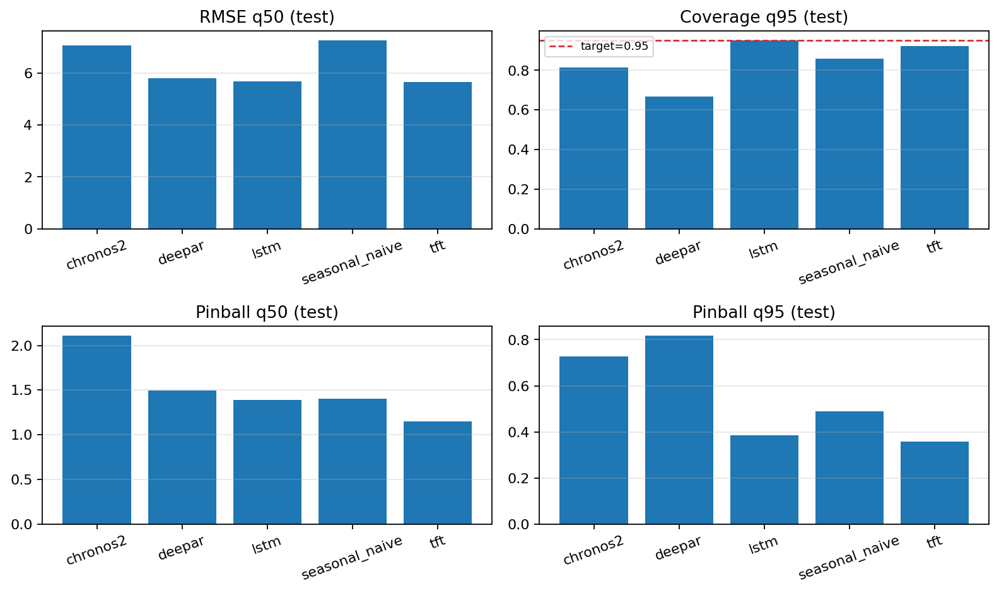
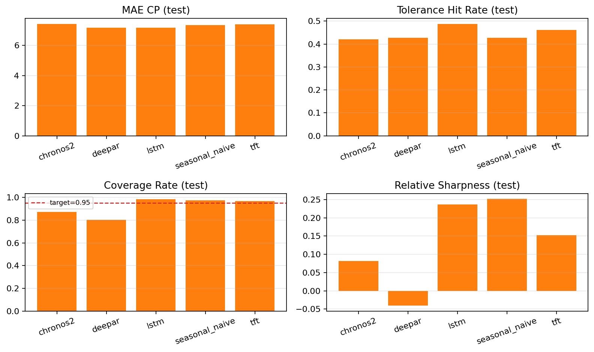
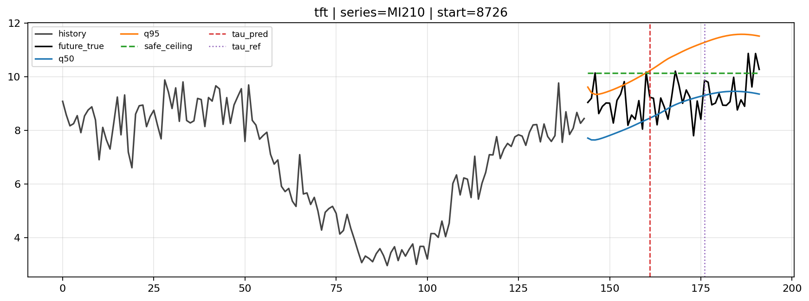
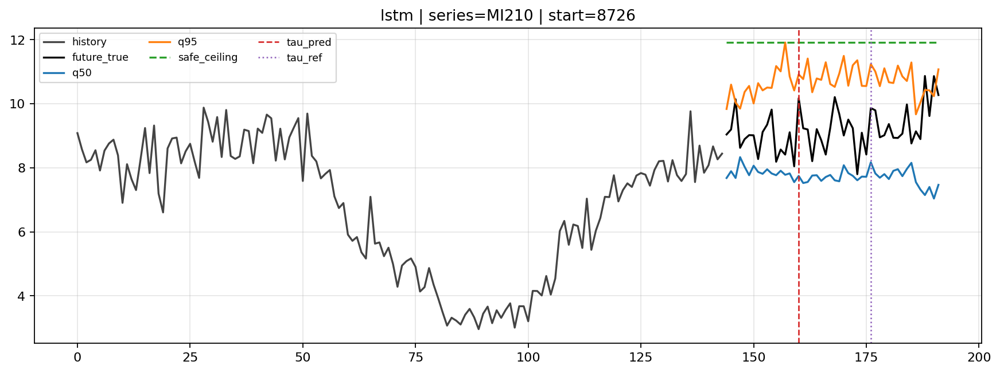
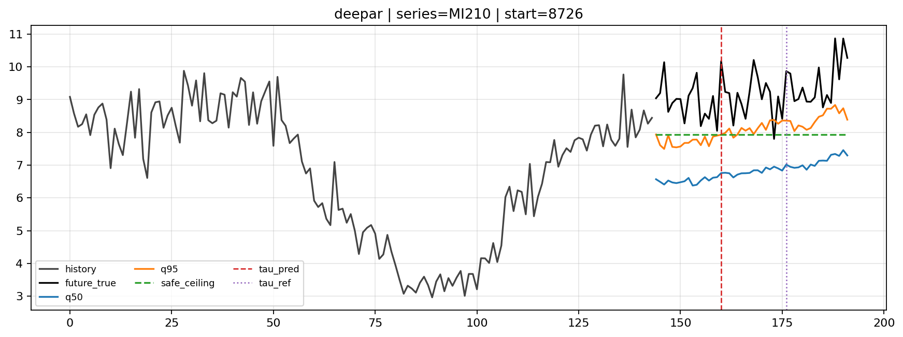
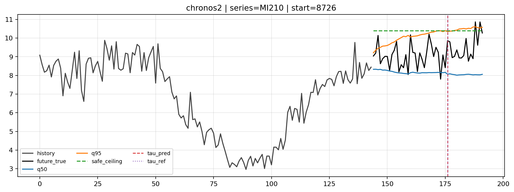
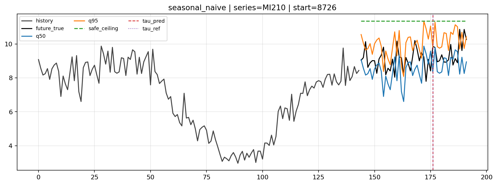

# LLM6G

Codebase for the paper:
**LLM6G: A Shift-Aware Forecast-to-Control Pipeline for 6G Mobile Network Traffic**
Submitted to IEEE FINE 2026.

---

## What this repo is

This is the reproducible research codebase for the LLM6G paper. The paper proposes a general shift-aware forecast-to-control pipeline for mobile network traffic and benchmarks five probabilistic forecasters — including Chronos-2 (zero-shot) and TFT (trained) — on the public TIM Milan dataset.

The pipeline makes the next traffic regime break a first-class control object:

```
Recent history → Forecaster (q50, q95) → CLASP break detector (τ_pred)
              → Safe ceiling = max(q95[1:τ_pred]) → Hold policy until τ_pred → Refresh
```

Any forecaster that produces `(q50, q95)` over a fixed horizon plugs in unchanged.

---

## Main findings

Coverage and relative sharpness are competing objectives. No model dominates both.

### Forecast quality — test set (7,400 windows)

| Model          | RMSE  | Pinball q50 | Pinball q95 | Coverage q95 |
|----------------|-------|-------------|-------------|--------------|
| TFT            | 5.658 | 1.152       | 0.357       | 0.924        |
| LSTM           | 5.684 | 1.389       | 0.385       | 0.951        |
| DeepAR         | 5.796 | 1.493       | 0.817       | 0.667        |
| Chronos-2      | 7.070 | 2.108       | 0.728       | 0.814        |
| Seasonal Naive | 7.263 | 1.405       | 0.489       | 0.858        |

### System quality — test set (7,400 windows)

| Model          | MAE_CP | Tol. Hit | Coverage | Rel. Sharpness |
|----------------|--------|----------|----------|----------------|
| LSTM           | 7.175  | 0.487    | 0.984    | 0.237          |
| TFT            | 7.386  | 0.462    | 0.968    | 0.153          |
| Seasonal Naive | 7.333  | 0.427    | 0.973    | 0.251          |
| Chronos-2      | 7.415  | 0.420    | 0.873    | **0.082**      |
| DeepAR         | 7.162  | 0.426    | 0.802    | −0.041 ⚠       |

**TFT** is the best trained operating point: 0.968 coverage, 0.153 relative sharpness.
**Chronos-2** achieves the tightest ceiling (0.082 relative sharpness — 8.2% excess above realized demand) with no domain training.
**DeepAR** relative sharpness −0.041 means the safe ceiling falls *below* realized traffic — a control failure caused by Gaussian intervals being too narrow for heavy-tailed traffic.

Relative sharpness = `(safe_ceiling − max_realized) / max_realized`. Positive = over-provisioning; negative = under-provisioning.

---

## Repository structure

```
src/                    pipeline, models, training, evaluation, reporting
data/                   dataset builders for TIM Milan
results/experiments/    machine-readable outputs of the main run
notebooks/              experiment report and run notebooks
```

### Key source files

| File | Role |
|------|------|
| `src/pipeline.py` | Probabilistic forecasting pipeline (all 5 models) |
| `src/run_experiment.py` | End-to-end experiment runner |
| `src/train.py` | Training loop (LSTM, TFT, DeepAR) |
| `src/evaluate.py` | Forecast evaluation (RMSE, pinball, coverage) |
| `src/system_eval.py` | System/control evaluation (MAE_CP, coverage, sharpness) |
| `src/cp_sweep.py` | CLASP hyperparameter sweep |
| `src/tau_calibration.py` | Post-hoc break timing calibration |
| `src/reporting.py` | Report and plot generation |
| `src/models.py` | LSTM, TFT, DeepAR model definitions |
| `src/change_detection.py` | CLASP change-point detector wrapper |

---

## Setup

```bash
python3 -m venv .venv && source .venv/bin/activate
pip install -r requirements.txt
```

Chronos-2 inference runs on CPU or MPS.

---

## Notebooks

- [run.ipynb](run.ipynb) — End-to-end experiment launcher. Builds the dataset and runs the full 5-model pipeline in one place.
- [experiment_report.ipynb](experiment_report.ipynb) — Read-only results viewer. Visualizes all 7 pipeline stages (training curves, forecast metrics, system metrics, CP sweep, tau calibration) from saved experiment artifacts.

---

## Data

**Source:** Barlacchi et al., *A multi-source dataset of urban life in the city of Milan and the Province of Trentino*, Scientific Data, 2015.

The dataset contains telecom activity proxies on a 100×100 grid over Milan at native 10-minute cadence. We use only the `InternetTraffic` field. Values are normalized grid-cell activity, not literal Mbps.

```
Full dataset:   10,000 raw cells → 8,883 fully observed cells (1,117 dropped)
Trainable subset:  200 cells — first 200 by ascending square_id (neutral, reproducible)
```

### Build the datasets

```bash
python data/build_tim_milan_dataset.py
# → data/data_tim_milan_10min.csv
# → data/data_tim_milan_10min_metadata.csv

python data/build_tim_milan_trainable_subset.py
# → data/data_tim_milan_10min_trainable_200.csv
# → data/data_tim_milan_10min_trainable_200_metadata.csv
```

---

## Run the published experiment

```bash
python src/run_experiment.py \
  --with-tau-calibration \
  --overwrite \
  --data-path data/data_tim_milan_10min_trainable_200.csv \
  --context-length 144 \
  --horizon 48 \
  --models lstm,deepar,tft,chronos2,seasonal_naive \
  --train-window-step 6 \
  --batch-size 64 \
  --max-epochs 30 \
  --validate-epochs 1 \
  --patience 3 \
  --cp-max-windows-per-series 50 \
  --device auto
```

**Pipeline stages run in order:**
`prepare_data → train → forecast_eval → system_eval → cp_sweep → tau_calibration`

**Experiment directory:**
`results/experiments/data_tim_milan_10min_trainable_200_ctx144_h48/q50_q95_seed42/`

**Key configuration:**
- Context = 144 steps (24 h — one full daily cycle)
- Horizon = 48 steps (8 h)
- Quantiles: q50, q95
- Split: 70 / 10 / 20 chronological (train 6,249 / val 893 / test 1,786 rows)
- Windows: non-overlapping, step = 48 → 7,400 test windows, 3,600 val windows
- Seed: 42

---

## Model details

### TFT — best trained model
Temporal Fusion Transformer with variable selection networks, encoder-decoder LSTM (hidden 128, 2 layers, dropout 0.1), 4-head interpretable self-attention, and a direct quantile output head at q50/q95.

**Channel-selective instance normalization:** the raw-value channel is normalized independently from the time-feature channels (cyclic hour-of-day, day-of-week). Normalizing time features destroys their positional meaning. Without this fix, the validation-to-test RMSE gap exceeds 30%.

### Chronos-2 — LLM component, zero-shot
`amazon/chronos-2` (120M parameters). Pretrained on a large diverse corpus via quantized token autoregression. No Milan-specific fine-tuning. Quantiles extracted from sampled token paths.

This is the LLM in LLM6G: a foundation model deployed directly into a 6G-oriented control loop. The key property is that it requires no retraining when the traffic distribution shifts.

### LSTM — trained baseline
2-layer LSTM (hidden 128, dropout 0.1), direct quantile output head. Instance normalization on the context window.

### DeepAR — cautionary baseline
Autoregressive LSTM with per-series embeddings (dim 20), Gaussian likelihood, 200 Monte Carlo samples at inference. Gaussian intervals prove too narrow for heavy-tailed traffic: q95 coverage 0.667, relative sharpness −0.041. Included as a documented case of correct architecture with likelihood mismatch.

### Seasonal Naive — lower baseline
Q50: lag-144 value (yesterday-same-time). Q95: Q50 + 95th percentile of historical differences over the context. No training.

### CLASP — change-point detector
Non-parametric detector. Classifies sliding windows as pre/post-change via k-NN accuracy on z-normalized features. Returns τ with maximum score if score ≥ threshold; otherwise returns "no break" — enabling the pipeline to hold a single ceiling over the full horizon when the regime is stable.

Tuned via validation grid search over 36 combinations (min_size ∈ {8,10,12}, period_length ∈ {8,16,auto}, score_threshold ∈ {0.5,0.6,0.7,0.75}). Best config for all models: min_size=8, period_length=16, score_threshold=0.5.

---

## Evaluation metrics

**Forecast metrics** (per window):
- `RMSE_q50` — point accuracy of the median path
- `Pinball_q50`, `Pinball_q95` — quantile calibration
- `Coverage_q95` — fraction of realized values below q95

**System/control metrics** (per window):
- `MAE_CP` — mean absolute error between predicted and realized break position (in steps)
- `Tolerance hit rate` — fraction where |τ_pred − τ_true| ≤ 3 steps (30 min)
- `Coverage rate` — fraction of windows where safe ceiling ≥ realized peak over the control interval
- `Relative sharpness` — `(safe_ceiling − max_realized) / max_realized` — scale-invariant excess

---

## Figures





Per-model pipeline examples (same saved test window):











---

## References

- TIM Milan dataset: <https://doi.org/10.1038/sdata.2015.55>
- Chronos-2: <https://arxiv.org/abs/2510.15821>
- TFT: Lim et al. (2021), International Journal of Forecasting
- DeepAR: <https://arxiv.org/abs/1704.04110>
- CLASP: Ermshaus et al., CIKM 2022
- IEEE FINE 2026: <https://www.ieee-fine.org/2026/>

---

Colin Minini