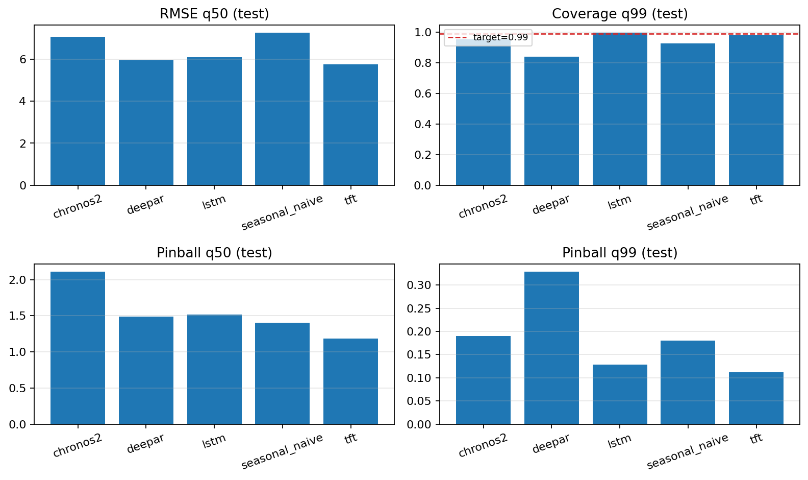
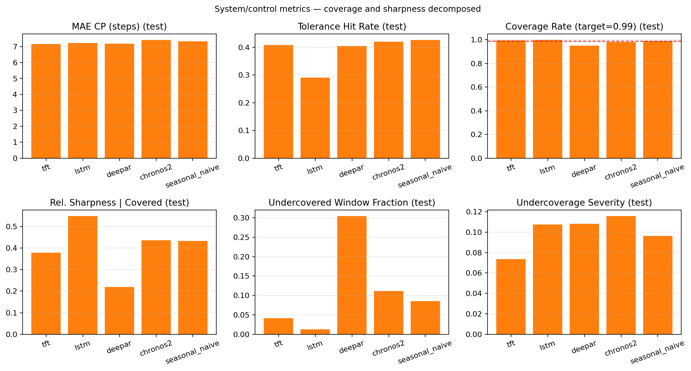
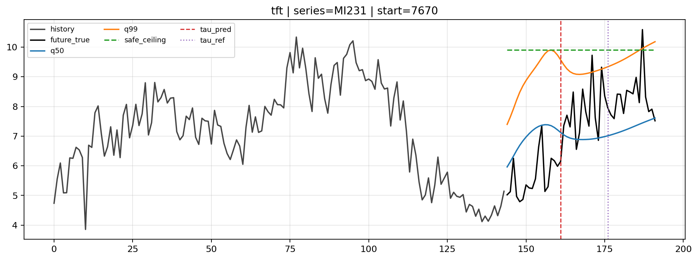
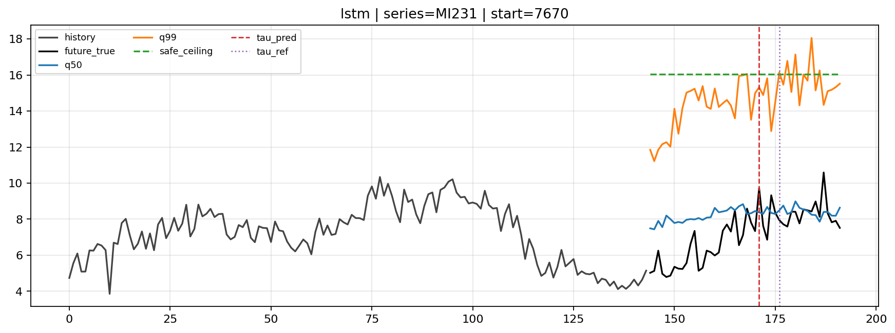
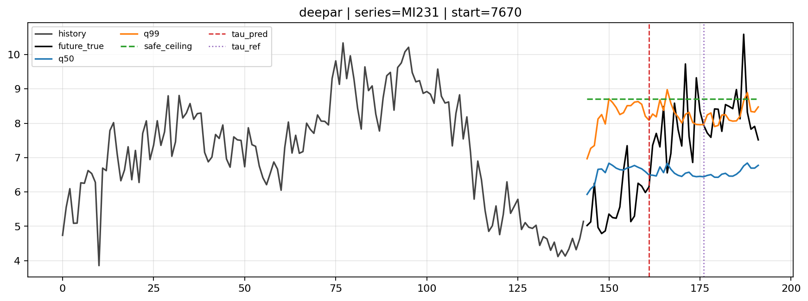
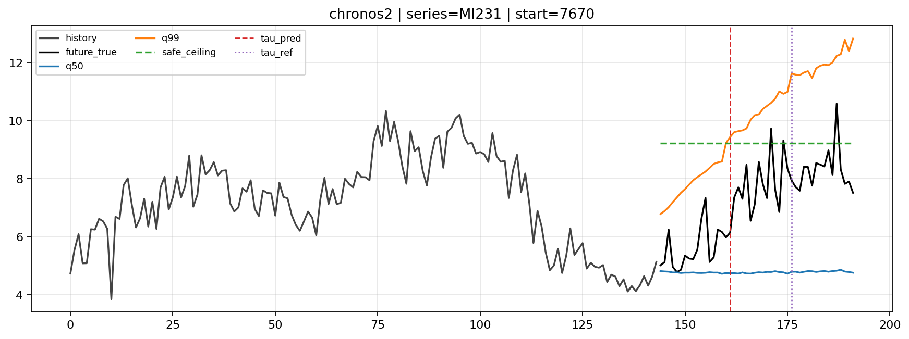
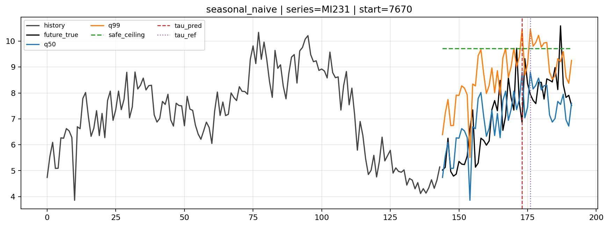

# Forecast Accuracy Is Not Control Quality

Codebase for the paper:
**Forecast Accuracy Is Not Control Quality: Energy-Aware Benchmarking of Cellular Traffic Forecasters**

---

## What this repo is

Reproducible research codebase for a shift-aware forecast-to-control pipeline benchmarked on the public TIM Milan dataset. Five probabilistic forecasters — TFT, LSTM, DeepAR, Chronos-2 (zero-shot), Seasonal Naive — share the same output interface and plug into the same control loop, so differences in the results trace back to the forecaster and not to the surrounding machinery.

The pipeline:

```
Context x_{t-C+1:t} → Forecaster (q50, q99) → CLASP break detector (τ_pred)
                   → Safe ceiling c_safe = max(q99[1:τ_pred])
                   → Provision at c_safe for [1, τ_pred] → Refresh
```

All interval-based metrics are evaluated on the committed interval `I_pred = x_{1:τ_pred}` — what the controller actually observes before the next refresh.

---

## Main findings

### Forecast quality — test set (7,400 windows)

| Model          | RMSE q50 | Pinball q50 | Pinball q99 | Coverage q99 |
|----------------|----------|-------------|-------------|--------------|
| TFT            | **5.756** | **1.185**  | **0.112**   | 0.982        |
| LSTM           | 6.103    | 1.514       | 0.129       | **0.997**    |
| DeepAR         | 5.942    | 1.489       | 0.329       | 0.840        |
| Chronos-2      | 7.070    | 2.108       | 0.190       | 0.953        |
| Seasonal Naive | 7.263    | 1.405       | 0.180       | 0.927        |

### Control quality — committed-interval metrics (7,400 windows)

| Model          | Coverage | S̃_cov (covered slack) | U_f (undercov. %) | U_s (undercov. severity) |
|----------------|----------|------------------------|-------------------|--------------------------|
| TFT            | 0.996    | 0.378                  | 4.1%              | **0.074**                |
| LSTM           | **0.999** | 0.549                 | **1.3%**          | 0.107                    |
| DeepAR         | 0.949    | **0.219**              | 30.5%             | 0.108                    |
| Chronos-2      | 0.981    | 0.437                  | 11.1%             | 0.116                    |
| Seasonal Naive | 0.989    | 0.433                  | 8.5%              | 0.096                    |

**Forecast accuracy is not control quality.** DeepAR is second on RMSE yet breaches its safe ceiling on 30.5% of test windows.

**Loss, not architecture, drives control behavior.** LSTM and DeepAR share a near-identical recurrent backbone (211,552 vs 215,202 params). The pinball head (LSTM) gives U_f = 1.3%; the Gaussian-NLL head (DeepAR) gives U_f = 30.5%.

**Deep learning does not justify its energy budget on this benchmark.** Under annual deployment accounting (quarterly retraining across markets, live inference every 10 minutes), Seasonal Naive anchors the Pareto floor on covered sharpness and breach frequency. Zero-shot Chronos-2 is effectively tied with Seasonal Naive on S̃_cov and strictly worse on both U_f and U_s. TFT is the only trained deep model that meaningfully improves control quality, at several orders of magnitude more compute.

Metric definitions:
- `S̃_cov` = over-provisioning slack on covered windows (covered ratio-of-sums): `Σ Δ_i / Σ M_i` for windows with `Δ_i = c_safe - M_i ≥ 0`.
- `U_f` = fraction of windows where `Δ_i < 0` (ceiling breaches realized peak).
- `U_s` = mean relative breach depth on undercovered windows.

---

## Repository structure

```
src/                    pipeline, models, training, evaluation, reporting, energy
data/                   dataset builders for TIM Milan
results/experiments/    machine-readable outputs of the main run
notebooks/              experiment report and run notebooks
paper_v2/               LaTeX source of the paper
tests/                  unit tests
```

### Key source files

| File | Role |
|------|------|
| `src/pipeline.py` | Probabilistic forecasting pipeline (all 5 models) |
| `src/run_experiment.py` | End-to-end experiment runner |
| `src/train.py` | Training loop (LSTM, TFT, DeepAR) |
| `src/models.py` | LSTM, TFT, DeepAR model definitions |
| `src/forecast_eval.py` | Forecast evaluation (RMSE, pinball, coverage) |
| `src/system_eval.py` | Committed-interval control evaluation |
| `src/system_metrics.py` | Coverage, S̃_cov, U_f, U_s definitions |
| `src/energy.py` | Analytical FLOPs and deployment-energy accounting |
| `src/energy_eval.py` | Energy report assembly per forecaster |
| `src/change_detection.py` | CLASP change-point detector wrapper |
| `src/cp_sweep.py` | CLASP hyperparameter sweep |
| `src/tau_calibration.py` | Post-hoc break timing diagnostic |
| `src/reporting.py` | Report and plot generation |

---

## Setup

```bash
python3 -m venv .venv && source .venv/bin/activate
pip install -r requirements.txt
```

Chronos-2 inference runs on CPU or MPS.

---

## Notebooks

- [notebooks/run.ipynb](notebooks/run.ipynb) — End-to-end experiment launcher.
- [notebooks/experiment_report.ipynb](notebooks/experiment_report.ipynb) — Read-only results viewer over saved experiment artifacts.

---

## Data

**Source:** Barlacchi et al., *A multi-source dataset of urban life in the city of Milan and the Province of Trentino*, Scientific Data, 2015.

The dataset contains telecom activity proxies on a 100×100 grid over Milan at native 10-minute cadence. We use only the `InternetTraffic` field. Values are normalized grid-cell activity, not literal Mbps.

```
Full dataset:       10,000 raw cells → 8,883 fully observed cells (1,117 dropped)
Trainable subset:   200 cells — first 200 by ascending square_id (neutral, reproducible)
Timestamps:         8,928 from 2013-11-01 to 2014-01-01
```

### Build the datasets

```bash
python data/build_tim_milan_dataset.py
# → data/data_tim_milan_10min.csv
# → data/data_tim_milan_10min_metadata.csv

python data/build_tim_milan_trainable_subset.py
# → data/data_tim_milan_10min_trainable_200.csv
# → data/data_tim_milan_10min_trainable_200_metadata.csv
```

---

## Run the published experiment

```bash
python src/run_experiment.py \
  --overwrite \
  --data-path data/data_tim_milan_10min_trainable_200.csv \
  --context-length 144 \
  --horizon 48 \
  --quantiles 0.5,0.99 \
  --models lstm,deepar,tft,chronos2,seasonal_naive \
  --batch-size 64 \
  --max-epochs 30 \
  --patience 3 \
  --device auto
```

**Pipeline stages run in order:**
`prepare_data → train → forecast_eval → cp_sweep → system_eval → tau_calibration → calibrated_system_eval → energy_eval`

**Experiment directory:**
`results/experiments/data_tim_milan_10min_trainable_200_ctx144_h48/q50_q99_seed42/`

**Key configuration:**
- Context = 144 steps (24 h — one full daily cycle)
- Horizon = 48 steps (8 h)
- Upper-quantile target: q99 (native to the Chronos-2 output grid)
- Split: 70 / 10 / 20 chronological (train 6,249 / val 893 / test 1,786 rows)
- Windows: non-overlapping, step = 48 → 7,400 test windows
- Seed: 42

---

## Model details

### TFT
Temporal Fusion Transformer with variable selection networks, encoder-decoder LSTM (hidden 128, 2 layers, dropout 0.1), 4-head interpretable self-attention with shared value projection and causal mask, and a direct quantile head at q50/q99. Trained with pinball loss.

**Channel-selective instance normalization.** The raw-value channel is normalized independently from the time-feature channels (cyclic hour-of-day, day-of-week). Normalizing time features destroys their positional meaning; without this fix the validation-to-test RMSE gap exceeds 30%.

### LSTM
2-layer LSTM (hidden 128, dropout 0.1), context-level instance normalization, direct quantile head at q50/q99 trained with pinball loss. Included as the pinball-head counterpart to DeepAR: the two forecasters share their recurrent backbone, so the pair isolates the training-loss effect from the architectural effect.

### DeepAR
Autoregressive LSTM with per-series item embeddings (dim 20), time features (hour-of-day, day-of-week, log-age), and a Gaussian head emitting `(μ_t, σ_t)` per step. Trained with Gaussian NLL.

**Analytic-Gaussian deterministic rollout at inference.** The LSTM consumes the predicted mean at each step and the head emits `(μ_t, σ_t)`; upper-quantile paths are recovered in closed form as `μ_t + z_α · σ_t` with `z_0.99 ≈ 2.326`. This isolates the Gaussian-head assumption from sampling variance: any undercoverage that remains is attributable to the head, not to finite-sample noise.

### Chronos-2 (zero-shot)
`amazon/chronos-2` (120M parameters). Patch-based encoder-only transformer pre-trained on a large heterogeneous corpus. Deployed without any Milan-specific fine-tuning. A single forward pass emits 21 quantile levels, including q99 natively — no quantile interpolation.

### Seasonal Naive (training-free)
Q50: lag-144 value (yesterday-same-time). Q99: median + 0.99-quantile of historical residuals `{x_τ − x_{τ−144}}` measured over the context window. No training.

### CLASP — change-point detector
Non-parametric detector applied to the median path. Returns the globally highest-scoring split if its score ≥ threshold, otherwise emits a no-break decision so the controller holds a single ceiling over the full horizon when the regime is stable.

A validation-selected configuration is shared across all five forecasters: `min_size=8`, `period_length=16`, `score_threshold=0.5`.

---

## Evaluation metrics

**Forecast metrics** (per window):
- `RMSE_q50` — point accuracy of the median path
- `Pinball_q50`, `Pinball_q99` — quantile calibration
- `Coverage_q99` — fraction of realized values below q99

**Committed-interval control metrics** (per window, scored on `I_pred = x_{1:τ_pred}`):
- `Coverage` — ratio-of-sums fraction of realized values ≤ `c_safe` across all windows
- `S̃_cov` — over-provisioning slack on covered windows (ratio-of-sums over Δ_i ≥ 0)
- `U_f` — undercoverage frequency: fraction of windows with `Δ_i < 0`
- `U_s` — undercoverage severity: mean relative breach depth on undercovered windows

---

## Energy accounting

Analytical FLOPs under the standard convention:
- Forward: `F_fwd ≈ 2 · params · tokens`
- Training: `F_train ≈ 3 · F_fwd · N_iters` (one forward + ≈2× backward)
- Annual inference: `F_fwd · N_calls^market · m` for `m` markets, live 10-minute cadence, 365 days
- Trainable models retrain quarterly (`R = 4`)

Parameter counts for trainable models are recovered exactly from saved checkpoints (TFT 1.83 M, LSTM 211,552, DeepAR 215,202). Chronos-2 uses its 120 M public checkpoint and pays zero retraining. Seasonal Naive and Chronos-2 pay only the deployment-inference term.

FLOPs are converted to joules under two hardware constants bracketing plausible deployments:
- `J_GPU = 1.3e-12` J/FLOP (A100 fp16, ~312 TFLOPS at ~400 W)
- `J_CPU = 1.0e-9` J/FLOP (x86 Skylake fp32, ~1 GFLOP/s/W)

The accounting charges one forecast invocation per cadence step — a conservative upper bound relative to the receding-horizon loop, which only invokes the forecaster once per committed interval. Because the same divisor applies to every forecaster, the relative ordering on the energy axis is invariant to this simplification.

---

## Figures





Per-model pipeline examples on the same test windows:











---

## References

- TIM Milan dataset: <https://doi.org/10.1038/sdata.2015.55>
- Chronos-2: <https://arxiv.org/abs/2510.15821>
- TFT: Lim et al. (2021), International Journal of Forecasting
- DeepAR: <https://arxiv.org/abs/1704.04110>
- CLASP: Ermshaus et al., CIKM 2022

---

Colin Minini
